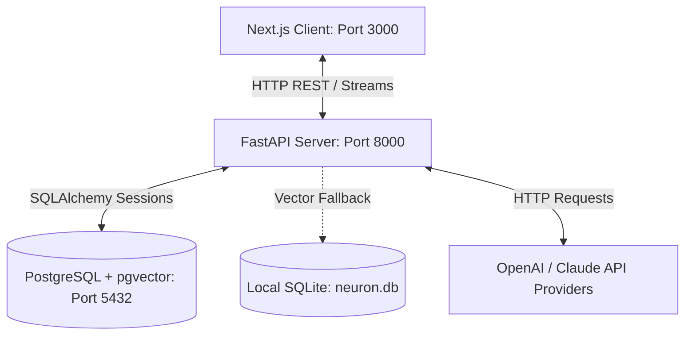

# System Architecture — NEURON OS

NEURON OS is organized as a modular monorepo comprising a Next.js client, a FastAPI API gateway, and a PostgreSQL database.

## 🗺️ Monorepo Diagram

## 📂 Core Directories

* **`/frontend`:** Handles presentation, dashboard graphs, system telemetry polls, and chat displays.
* **`/backend`:** Exposes REST interfaces, runs NLP calculations, computes similarity scores, manages security, and connects database models.
* **`/project-context`:** The persistent engineering specifications (SSOT).
* **`docker-compose.yml`:** Container orchestrator for Postgres, FastAPI backend, and Next.js frontend.

## 🔗 Communication Protocols
1. **HTTP REST:** Used for database updates, register, logins, fetching conversation arrays, and deleting nodes.
2. **Server Streams:** Response flows are written using FastAPI `StreamingResponse` over HTTP chunk transfers, allowing real-time token feedback.
