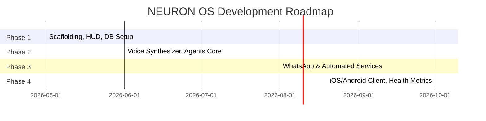

# NEURON OS Roadmap

The roadmap charts milestones for expanding NEURON OS into a comprehensive personal AI intelligence engine.

## 🗺️ Phase Milestones

### [ACTIVE] Phase 1 — Foundations & Core Experience
* Monorepo layouts, FastAPI APIs, and Next.js bootstrap.
* Cinematic landing page, login page, and dashboard Command center.
* Streaming response APIs, local vector math fallbacks.
* Multi-container Docker orchestration.

### [UPCOMING] Phase 2 — Voice Interface & Agent Executives
* Voice control pipelines (speech-to-text, offline sound models).
* Multi-agent execution setups (subagents executing code, resolving tasks).
* Command bar search engines.

### [UPCOMING] Phase 3 — Integrations & Automation Ecosystems
* WhatsApp, Email, Slack notifications gateways.
* Scheduled script triggers.

### [UPCOMING] Phase 4 — Wearables & Client Wrappers
* Android / iOS companion setups.
* Apple Health, Fitbit metrics charts.
